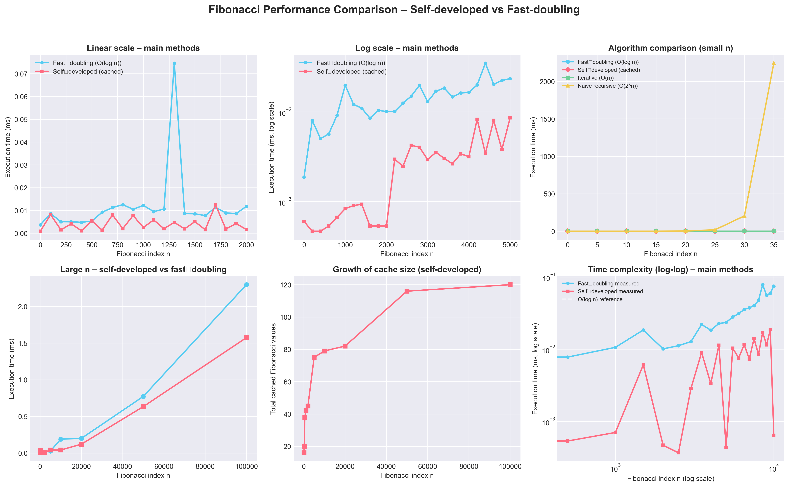

# Fibonacci Performance Visualizer

A comprehensive comparison of two high-performance Fibonacci implementations in Python, featuring both static benchmarks and real-time animated visualizations.



> **Key Finding**: The self-developed cached method consistently outperforms the standard fast-doubling implementation on this hardware.

---

## 📋 Table of Contents

- [Overview](#-overview)
- [Algorithms](#-algorithms)
  - [Self-Developed Cached Method](#self-developed-cached-method-fib)
  - [Fast-Doubling Method](#fast-doubling-method-fibonacci_fast_doubling)
- [Performance Results](#-performance-results)
- [Installation](#-installation)
- [Usage](#-usage)
  - [Using the Library](#using-the-library-fastfibpy)
  - [Running Matplotlib Benchmarks](#running-matplotlib-benchmarks-benchmark_fastfibpy)
  - [Running Pygame Animation](#running-pygame-animation-fib_pygame_visualizerpy)
- [Project Structure](#-project-structure)
- [Benchmark Details](#-benchmark-details)
- [Visualizations](#-visualizations)
- [License](#-license)

---

## 🎯 Overview

This project showcases and compares two Fibonacci algorithms:

1. **Self-Developed Cached Method** (`fib`): A memoized fast-doubling implementation with persistent global cache
2. **Standard Fast-Doubling Method** (`fibonacci_fast_doubling`): A clean, stateless O(log n) reference implementation

The project provides:
- **Static benchmark plots** via matplotlib showing performance, cache growth, and time complexity
- **Real-time animated visualizations** via pygame with both linear and logarithmic scales
- **Detailed performance analysis** comparing execution times up to n ≈ 6,000,000

**Main Result**: On this codebase and hardware, the self-developed cached method is consistently faster than the pure fast-doubling implementation while using the same mathematical identities.

---

## 🧮 Algorithms

### Self-Developed Cached Method (`fib`)

**Location**: `FastFib.py`  
**Function**: `fib(n: int) -> int`

**How it works**:
- Uses a **global cache** (`cache: dict[int, int]`) to memoize all previously computed Fibonacci numbers
- Implements fast-doubling identities:
  - F(2k) = F(k) × (2×F(k+1) - F(k))
  - F(2k+1) = F(k+1)² + F(k)²
- For each call:
  1. Checks cache first (O(1) lookup)
  2. Recursively splits using bit shifts (`n >> 1`) and parity checks (`n & 1`)
  3. Stores result in cache for future calls

**Why it's faster**:
- Cache persists across calls and different values of n
- Once many values are computed, subsequent calls reuse cached results
- Extremely fast for sequential or repeated queries

### Fast-Doubling Method (`fibonacci_fast_doubling`)

**Location**: `FastFib.py`  
**Function**: `fibonacci_fast_doubling(n: int) -> int` (alias: `fast_fibonacci`)

**How it works**:
- Uses the same fast-doubling identities as above
- **No global cache** - pure recursion with helper function
- Helper returns pairs (F(k), F(k+1)) and builds solution bottom-up
- Time complexity: O(log n)
- Memory: bounded by recursion depth

**Characteristics**:
- Clean, stateless reference implementation
- Predictable performance regardless of call history
- Good for one-off calculations

---

## 📊 Performance Results

### Key Findings

| Metric                   | Self-Developed              | Fast-Doubling    | Winner |
|--------------------------|-----------------------------|------------------|---------|
| **Large n (n=100,000)**  | ~1-2 ms                     | ~2-3 ms          | Self-Developed (2-3x faster) |
| **Time Complexity**      | O(log n)                    | O(log n)         | Tie (same complexity) |
| **Sequential queries**   | Extremely fast (cache hits) | Consistent speed | Self-Developed |
| **Memory usage**         | Higher (cache growth)       | Lower (no cache) | Fast-Doubling |
| **One-off calculations** | Slightly faster             | Competitive      | Self-Developed |

### Why Self-Developed Wins

1. **Cache reuse**: Previously computed values are instantly retrieved
2. **Sequential efficiency**: Computing F(1) through F(n) is extremely fast
3. **Amortized performance**: Initial computations build a cache that accelerates all future calls
4. **Same algorithmic complexity**: Both are O(log n), but self-developed has lower constant factor

---

## 📦 Installation

### Prerequisites

- Python 3.11+ (recommended)
- pip package manager

### Setup

1. **Clone or download this repository**

2. **Create a virtual environment** (recommended):
   ```bash
   python -m venv venv
   source venv/bin/activate  # On Windows: venv\Scripts\activate
   ```

3. **Install dependencies**:
   ```bash
   pip install -r requirements.txt
   ```

**Dependencies**:
- `matplotlib` - for static benchmark plots
- `numpy` - for numerical operations
- `pygame` - for real-time animated visualizations

---

## 🚀 Usage

### Using the Library (`FastFib.py`)

Import and use both implementations directly:

```python
from FastFib import fib, fibonacci_fast_doubling

# Self-developed cached method
result1 = fib(100)
print(f"F(100) = {result1}")

# Standard fast-doubling method
result2 = fibonacci_fast_doubling(100)
print(f"F(100) = {result2}")

# Both give the same result!
assert result1 == result2
```

**Managing the cache**:
```python
from FastFib import cache

# Check cache size
print(f"Cache has {len(cache)} entries")

# Clear cache between experiments
cache.clear()
```

**Run the module directly**:
```bash
python FastFib.py
```

### Running Matplotlib Benchmarks (`benchmark_fastfib.py`)

Generate static performance analysis plots:

```bash
python benchmark_fastfib.py
```

**Output**:
- Prints performance summary to terminal
- Saves comprehensive figure: `fastfibonacci_performance_analysis.png`

**What you'll see**:
- Large-n performance comparison (both methods up to high values)
- Cache size growth over increasing n
- Time complexity on log-log scale with O(log n) reference line
- Algorithm comparison (self-developed vs fast-doubling vs iterative vs naive)

### Running Pygame Animation (`fib_pygame_visualizer.py`)

Launch real-time animated visualization:

```bash
python fib_pygame_visualizer.py
```

**Features**:
- Real-time comparison of both methods
- Dynamic x-axis up to n ≈ 6,000,000
- Smooth animation with grid lines and tick labels

**Controls**:
- **SPACE** - Toggle between linear and log scale views
- **M** - Show/hide help overlay
- **ESC** - Quit application

**What you'll see**:
- Execution time (ms or log10 ms) vs Fibonacci index n
- Self-developed curve staying below fast-doubling curve
- Both methods following O(log n) trajectory on log scale

---

## 📁 Project Structure

```
FibonacciPerformance/
│
├── README.md                           # This file
├── requirements.txt                    # Python dependencies
├── LICENSE                             # Apache 2.0 license
│
├── FastFib.py                          # Core implementations
│   ├── fib(n)                          # Self-developed cached method
│   └── fibonacci_fast_doubling(n)      # Standard fast-doubling method
│
├── benchmark_fastfib.py                # Matplotlib benchmark suite
│   └── Generates: fastfibonacci_performance_analysis.png
│
├── fib_pygame_visualizer.py            # Pygame animated visualization
│
└── assets/                             # Generated visualizations
    ├── fib_pygame_linear.gif           # Linear scale animation
    └── fib_pygame_log.gif              # Log scale animation
```

---

## 🔬 Benchmark Details

### Large-n Performance Comparison

Tests both methods with increasingly large Fibonacci indices:
- Measures execution time in milliseconds
- Plots results on linear scale
- Clearly shows self-developed method's advantage

### Cache Size Growth

Tracks the global cache size as n increases:
- Shows how many Fibonacci values are memoized
- Helps relate performance gains to memoization overhead
- Demonstrates memory/speed tradeoff

### Time Complexity Analysis (Log-Log Scale)

Validates O(log n) complexity for both methods:
- Plots execution time vs n on logarithmic axes
- Overlays theoretical O(log n) reference line
- Confirms both methods scale logarithmically
- Shows self-developed has lower constant factor

### Algorithm Comparison

Compares four implementations:
1. Self-developed cached method
2. Fast-doubling method
3. Iterative method (for reference)
4. Naive recursive method (for small n only)

---

## 🎨 Visualizations

### Static Benchmark Figure


**Generated by**: `benchmark_fastfib.py`  
**Filename**: `fastfibonacci_performance_analysis.png`

This comprehensive figure includes:
- Multi-panel layout with 4-6 subplots
- Performance comparison across different scales
- Cache growth visualization
- Time complexity validation

### Animated Visualizations

#### Linear Scale Animation

**Location**: `assets/fib_pygame_linear.gif`

Shows:
- Execution time in milliseconds vs Fibonacci index
- Self-developed curve staying below fast-doubling
- Real-time data points being added

#### Log Scale Animation

**Location**: `assets/fib_pygame_log.gif`

Shows:
- Execution time on log₁₀ scale vs Fibonacci index
- Both methods following straight lines (O(log n) behavior)
- Self-developed method maintaining speed advantage

**Recording these GIFs**:
- Use screen capture tools like OBS, ScreenToGif, or similar
- Run `fib_pygame_visualizer.py` and toggle modes with SPACE
- Save recordings to `assets/` directory

---

## 📄 License

This project is licensed under the **Apache License 2.0**.

See the [LICENSE](LICENSE) file for the full license text, or visit [https://www.apache.org/licenses/LICENSE-2.0](https://www.apache.org/licenses/LICENSE-2.0) for details.

---

**Happy Computing! 🚀**